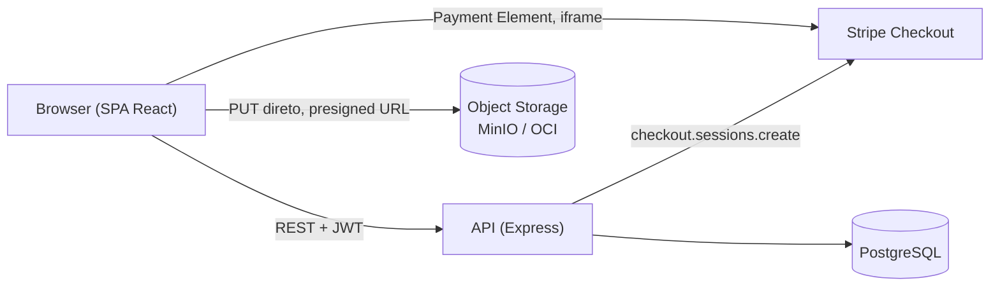

# Ingressar

Plataforma de venda de ingressos para eventos, conectando organizadores e compradores. Pagamentos via Stripe (test mode).

## Status atual

MVP em andamento, autenticação com roles (organizer/buyer, escolhido no cadastro), refresh token (access 15min em memória + refresh cookie httpOnly 7d), RBAC (`requireRole`, `requireEventOwner`), logout, reset de senha, validação de input com Zod e rate limiting aplicados nas rotas públicas e autenticadas. Gestão de eventos com transições de status, paginação e dashboard de vendas. Checkout de ingressos via Stripe (test mode) com validação de capacidade concorrente. Upload de banner de evento via presigned URL direto pro Object Storage (MinIO em dev), e preview HTML com OG tags para crawlers de redes sociais. Frontend React completo (todas as páginas do fluxo de compra e gestão de eventos). Testes unitários e de integração no backend, testes de componente (com a11y) e E2E no frontend. Webhook de confirmação de pagamento pendente, tickets ficam `pending` após o pagamento.

## Arquitetura



A URL assinada (presigned) é computada localmente na API, a partir das credenciais — não existe chamada de rede API → Storage nessa etapa, só o `PUT` do browser direto pro bucket.

## Stack

| Camada | Tecnologia |
|---|---|
| Backend | Node.js 20 + Express 5 + TypeScript |
| Frontend | React 19 + TypeScript + Vite + Tailwind CSS v4 + TanStack Query |
| Banco de dados | PostgreSQL 16 |
| ORM | Prisma 7 (adapter nativo pg) |
| Object Storage | S3-compatible (MinIO em dev, OCI Object Storage em prod) — `@aws-sdk/client-s3` |
| Autenticação | JWT (access + refresh) + bcrypt |
| Testes (backend) | Jest + Supertest + jest-mock-extended |
| Testes (frontend) | Vitest + React Testing Library + vitest-axe + Playwright |
| Pagamentos | Stripe Checkout (Elements, test mode) — webhook de confirmação pendente |
| Infraestrutura | Docker Compose (dev) / Kubernetes (prod) |

## Rodando localmente

**Pré-requisitos:** Docker, Node.js 20+

```bash
# 1. Suba o banco de dados e o MinIO (Object Storage local)
cp .env.example .env   # preencha as variáveis
docker compose up -d

# 2. Backend: instale dependências e rode as migrations
cd app/api
cp .env.example .env   # preencha DATABASE_URL, JWT_SECRET, JWT_REFRESH_SECRET e as chaves de teste da Stripe
npm install
npx prisma migrate dev
npm run dev   # API em http://localhost:3001

# 3. Frontend: em outro terminal
cd app/frontend
cp .env.example .env   # preencha VITE_STRIPE_PUBLISHABLE_KEY
npm install
npm run dev   # SPA em http://localhost:5173
```

O bucket do MinIO (`event-banners`) precisa existir antes do primeiro upload de banner.

## Endpoints

| Método | Rota | Auth | Descrição |
|---|---|---|---|
| GET | `/status` | — | Health check |
| POST | `/auth/register` | — | Cadastro de usuário (`role`: organizer ou buyer, buyer por padrão) |
| POST | `/auth/login` | — | Login — retorna `accessToken` (15min) e seta cookie httpOnly com refresh token (7d) |
| POST | `/auth/refresh` | Cookie | Renova o access token usando o refresh token |
| POST | `/auth/logout` | JWT | Encerra a sessão (limpa o cookie de refresh token) |
| POST | `/auth/forgot-password` | — | Gera um token de redefinição de senha (válido por 1h, uso único) |
| POST | `/auth/reset-password` | — | Redefine a senha a partir de um token válido |
| GET | `/events` | — | Lista eventos publicados, paginado (`page`, `limit`, `sort`, `order`) |
| GET | `/events/mine` | JWT (organizer) | Eventos do organizador logado, em qualquer status |
| GET | `/events/:id` | — | Detalhes de um evento |
| GET | `/events/:id/preview` | — | HTML com OG tags (title/description/image), para crawlers de redes sociais |
| POST | `/events` | JWT (organizer) | Cria um evento |
| PATCH | `/events/:id` | JWT (organizer, dono) | Edita título, descrição, local, status ou `bannerUrl` de um evento |
| POST | `/events/:id/banner-upload-url` | JWT (organizer, dono) | Gera presigned URL (5min) pra upload direto do banner no Object Storage |
| GET | `/events/:id/dashboard` | JWT (organizer, dono) | Métricas de vendas do evento (ingressos vendidos, receita, capacidade restante, vendas por dia) |
| POST | `/events/:id/checkout` | JWT (buyer) | Inicia a compra de um ingresso via Stripe Checkout (Elements) — cria ticket `pending` e retorna `{ clientSecret, ticketId }` |
| GET | `/tickets/mine` | JWT | Ingressos do usuário logado |
| GET | `/tickets/:id` | JWT | Detalhes de um ingresso do usuário logado |

Envie o access token nas requisições autenticadas via header `Authorization: Bearer <token>`.

## Especificação da API (OpenAPI)

```bash
cd app/api
npm run docs:openapi   # gera app/api/openapi.json
```

A spec é gerada a partir dos mesmos schemas Zod usados nas rotas (`src/routes/*.ts` + `src/openapi/`) — não é mantida à mão, então não diverge do código como a tabela de endpoints acima pode divergir com o tempo. Importe o `openapi.json` gerado no Swagger UI, Postman ou Insomnia para explorar a API interativamente.

## Testes

```bash
# Backend
cd app/api
npm run test:unit          # mocks — não precisa de banco

docker compose -f ../../compose.test.yml up -d   # banco de teste isolado (porta 5433)
npm run test:integration

# Frontend
cd app/frontend
npm run test:components    # Vitest + React Testing Library + vitest-axe

# E2E (Playwright) — requer API + frontend rodando, e DISABLE_RATE_LIMIT=true na API
# (ver docs/testing.md#fluxos-e2e-com-playwright)
npm run test:e2e
```

## Modelos principais

- **User**: email, senha, `role` (organizer | buyer)
- **Event**: título, descrição, preço, data, local, capacidade, `bannerUrl`, `status` (draft | published | cancelled | finished), vinculado ao organizador
- **Ticket**: ingresso de um usuário para um evento, `status` (pending | confirmed | cancelled), QR code opcional
- **Payment**: registro de pagamento via Stripe vinculado ao ingresso, `status` (pending | paid | failed | refunded)
- **PasswordResetToken**: token de redefinição de senha com validade e uso único

## Estrutura

```
app/
  api/
    prisma/            # schema e migrations
    tests/
      unit/            # testes unitários (Prisma mockado)
      integration/     # testes de integração (banco de teste real)
    src/
      app.ts           # monta o Express app (usado pelos testes)
      index.ts         # inicia o servidor
      lib/             # cliente Prisma, tokens JWT, storage (S3), email (stub)
      middleware/      # autenticação JWT, RBAC (requireRole/requireEventOwner) e rate limiting
      routes/          # auth, events, tickets
  frontend/
    src/
      pages/           # Landing, EventDetail, Checkout, TicketList/Detail, Organizer*, Login/Register/...
      components/      # EventCard, TicketCard, PaymentForm, StatCard, SalesChart, ProtectedRoute, RoleRoute...
      hooks/           # useAuth, useEvents, useCheckout, useBannerUpload...
      lib/             # axios (interceptor de refresh), stripe, auth, format
    tests/e2e/         # Playwright
docker-compose.yml     # banco + MinIO de dev
compose.test.yml       # banco de teste (integration)
```